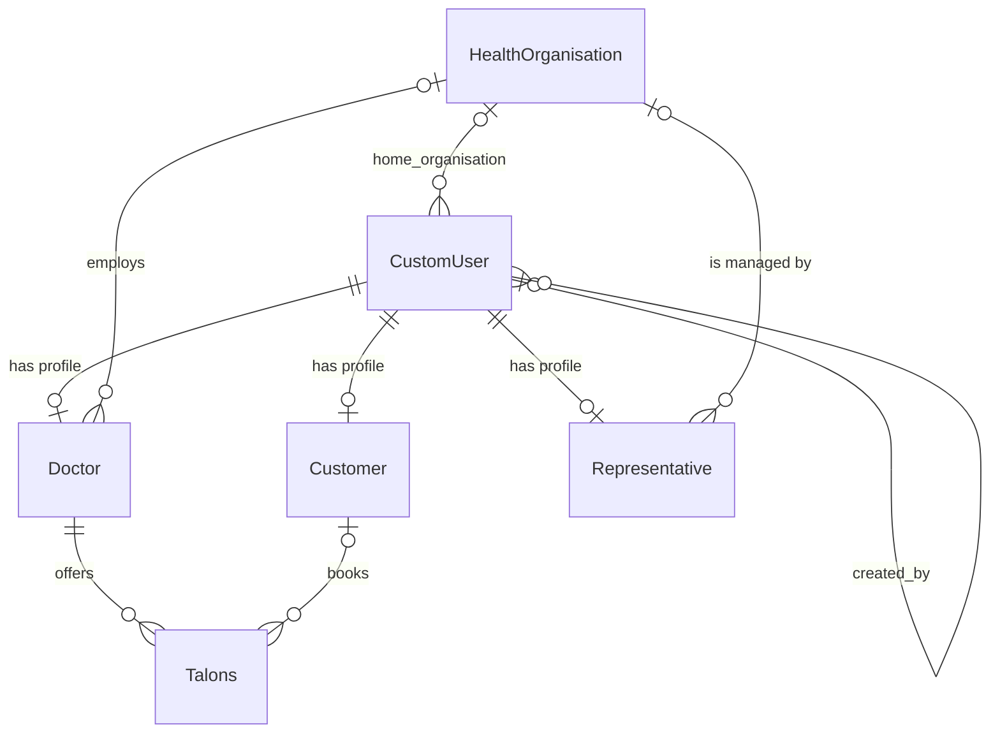

# TalonBy

TalonBy is a web app for booking medical appointments. Health organisations publish their doctors' appointment slots ("talons"), patients book the free ones, and each organisation's staff manage the schedule.

- **Backend:** Django + Django REST Framework, JWT auth (SimpleJWT), PostgreSQL, run with Docker Compose
- **Frontend:** React + TypeScript (Vite), MUI and MUI X Date Pickers, axios, dayjs

## Quick start

You need Docker and Node.js with npm.

1. **Environment files** (not in git). Split `backend/.env.example` into three files in `backend/`:
   - `.env.django`: the `DEBUG` and `DJANGO_*` lines, with a secret key filled in
   - `.env.db`: the `POSTGRES_*` lines, with a password filled in
   - `.env.redis`: the `REDIS_*` lines

   Then create `frontend/.env`:

   ```
   VITE_API_URL=http://127.0.0.1:8000/api/v1
   ```

2. **Backend:** `docker compose up --build`. Migrations run on start, and the API is served at http://127.0.0.1:8000/api/v1.
3. **Admin account.** The start script runs `createsuperuser --noinput`, but that fails silently because first and last names are required. Create the admin from the shell instead:

   ```bash
   docker compose exec django-web python /app/backend/manage.py shell -c "from users.models import CustomUser; CustomUser.objects.create_superuser('admin@example.com', 'change-me', first_name='Admin', last_name='User')"
   ```

4. **Frontend:** `cd frontend && npm install && npm run dev`, then open http://localhost:5173. Use `localhost`, not `127.0.0.1`, because CORS only allows `http://localhost:5173`.
5. **Git hooks,** once per clone: `pip install pre-commit && pre-commit install`. They run trailing-whitespace cleanup, ruff (backend), ESLint and Prettier (frontend).

The database lives in a Docker volume on each machine, so a fresh clone starts empty. There is no seed script. Log in as the admin and create organisations, representatives and doctors through the API or the Django admin at http://127.0.0.1:8000/admin/.

## Roles

Every account is a `CustomUser` that logs in by email. An account holds at most one role profile, and an admin holds none.

| Role             | Created by                              | Can do                                                                                               |
| ---------------- | --------------------------------------- | ---------------------------------------------------------------------------------------------------- |
| Customer         | themselves, on the Register page        | Book free talons, view and cancel their own bookings                                                 |
| Doctor           | an admin or a representative            | Manage their own talons and see who booked them                                                      |
| Representative   | an admin                                | Manage the doctors and talons of their own organisation, and create accounts                         |
| `/customer/{id}` | admin                                   | Retrieve, update and delete only. There is no list or create, because customers register themselves. |
| Admin            | the shell (`is_staff` / `is_superuser`) | Everything, including organisations and representatives                                              |

A doctor or representative without an organisation can't manage anything.

## Data model



| Model                | Key fields                                                                                                                                                                       |
| -------------------- | -------------------------------------------------------------------------------------------------------------------------------------------------------------------------------- |
| `CustomUser`         | `email` (login), `last_name`, `first_name`, `patronymic`; `home_organisation` (the organisation the account is earmarked for); `created_by` (who created the account, read-only) |
| `Customer`           | `sex`, `birthday`, `phone`, `address`                                                                                                                                            |
| `Doctor`             | `position`, `cabinet`, `slot_duration` (minutes), `work_schedule`, `health_organisation`                                                                                         |
| `Representative`     | `health_organisation`                                                                                                                                                            |
| `HealthOrganisation` | name, address and contacts; `schedule`                                                                                                                                           |
| `Talons`             | `doctor`, `customer` (empty means the slot is free), `date`, `time`; unique per doctor, date and time                                                                            |

Schedules are JSON keyed by weekday name (`"monday"` ... `"sunday"`):

- **Doctor** `work_schedule`: `{"monday": {"start": "09:00", "finish": "17:00"}, ...}`. Days off are simply left out.
- **Organisation** `schedule`: `{"monday": {"open": "08:00", "close": "20:00"}, ...}`. All seven days are required, and a closed day is `"00:00"`–`"00:00"`.

What deleting things does:

- **An organisation:** deletes its doctor and representative profiles and all of those doctors' talons. The accounts stay.
- **An account:** deletes its role profile. For a doctor that includes all their talons. For a customer it deletes the talons they booked.
- **A doctor profile:** deletes all of their talons.
- **An account that created or earmarked others:** `created_by` and `home_organisation` on those accounts are set to empty.

## Booking rules

A talon is valid only if all of these hold (`backend/appointments/utils.py`, `validate_appointment`):

1. Both the doctor and the organisation work that weekday.
2. It starts between 07:00 and 20:00.
3. It fits inside both schedules: it starts no earlier than the later opening time, and ends no later than the earlier closing time.
4. It is aligned: the minutes since that later opening time are a multiple of the doctor's `slot_duration`.
5. It doesn't overlap the doctor's other talons that day.

`frontend/src/utils/talonAvailability.ts` repeats these rules to offer only valid times in the create dialog. **Change both files together.**

Other rules:

- **Booked talons can't be edited or deleted** by anyone. To free one, cancel it. Cancelling is allowed for the customer who booked it, the doctor, a representative of the doctor's organisation, and an admin.
- **Past talons** can't be booked or cancelled.
- **Doctors with upcoming bookings** can't be deleted through `DELETE /doctor`.
- **Representatives** see and manage only their own organisation. Accounts they create are earmarked for their organisation and record them in `created_by`. Only that organisation's representatives, or an admin, can attach a doctor profile to such an account.
- **`slot_duration`** is fixed after a doctor is created, by convention. The UI offers no way to change it.

## API

Base URL: `/api/v1`. Send the token as `Authorization: Bearer <access>`. Router routes have no trailing slash. Only the `/token/...` routes do. Lists are not paginated.

| Endpoint                                                          | Who                                        | Notes                                                                                                                                            |
| ----------------------------------------------------------------- | ------------------------------------------ | ------------------------------------------------------------------------------------------------------------------------------------------------ |
| `POST /token/`, `/token/refresh/`, `/token/blacklist/`            | anyone                                     | Log in, refresh, log out. The access token lasts 10 minutes and the refresh token 7 days. The frontend refreshes automatically, Postman doesn't. |
| `POST /user/register`                                             | anyone                                     | Creates a customer                                                                                                                               |
| `GET /user/me`, `PATCH /user/update_me`, `DELETE /user/delete_me` | logged in                                  | Your own account. The `/me` response depends on your role.                                                                                       |
| `/user`                                                           | admin                                      | Create is also allowed for representatives                                                                                                       |
| `/health-organisation`                                            | read: anyone; write: admin                 |                                                                                                                                                  |
| `/doctor`                                                         | read: anyone; write: admin, representative | Filter with `?health_organisation=<id>`                                                                                                          |
| `/representative`                                                 | admin                                      |                                                                                                                                                  |
| `/appointment`                                                    | see below                                  | Talons                                                                                                                                           |
| `POST /appointment/{id}/book`                                     | customer                                   | Free, future talons only                                                                                                                         |
| `POST /appointment/{id}/cancel`                                   | see "Booking rules"                        |                                                                                                                                                  |

`GET /appointment` returns different talons depending on who asks: anonymous visitors get free ones, customers get their own plus free ones, doctors get their own, representatives get their organisation's, and admins get all. Filters: `doctor=<id>`, `date=YYYY-MM-DD`, `time=HH:MM` (that time onwards), `free=true|false`, `active=true|false` (future or past). Creating a talon needs `doctor_id`, except for a doctor creating their own.

Writes use `*_id` fields (`doctor_id`, `health_organisation_id`), while reads return nested objects under the plain name. DRF silently ignores unknown or misspelled fields, so if a change "doesn't save", check the field name first.

## Frontend map

```
frontend/src/
  api/          axios client (adds the token, refreshes once on 401) and one module per resource
  auth/         AuthProvider: the current user from /user/me; tokens in localStorage
  app/router.tsx  routes; RequireAuth sends guests to login, RequireRole blocks other roles
  pages/        public browsing, customer, doctor and representative pages
  components/   shared pieces, e.g. TalonManager, CreateTalonDialog, WorkScheduleEditor
  types/api/    TypeScript shapes of API data (trusted, not checked at runtime)
  utils/        talonAvailability.ts (slot rules), form validation helpers
```

The public booking flow is organisations, then positions, then doctors, then a doctor's calendar, then confirmation. Customers manage bookings at `/appointments`, doctors at `/doctor/talons`, and representatives under `/representative/...`.

Before committing frontend changes, run `npx tsc -b && npm run lint` in `frontend/`. There is no automated test suite yet. Changes have been checked by hand with Postman and the browser.

## Known issues

- **Clock mismatch.** The server runs on UTC, but talon times are local clock times (Minsk is UTC+3), so "now" checks on the backend are off by 3 hours. The frontend uses the browser's clock.
- **Deleting a customer account** deletes the talons they booked instead of freeing them.
- **The doctor-delete guard can be bypassed** by deleting the doctor's account, either by an admin or by the doctor through `delete_me`. The profile and its talons go with it.
- **No password change or reset** yet.
- **Compose warns that `REDIS_PASSWORD` is not set.** It reads `${REDIS_PASSWORD}` from the shell or a root `.env`, not from `backend/.env.redis`. Redis isn't used by the app yet.
